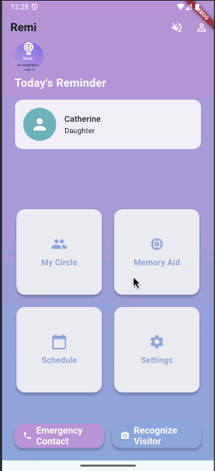

# Remi: An Alzheimer's Reminder App

## Overview
Remi is a mobile application designed to assist individuals with Alzheimer's and their caregivers. The app provides reminders, memory aids, and support features to help users manage daily tasks and maintain connections with loved ones.

## Walkthrough


## Features
- **Account Setup & Login:** Secure registration and login for users and caregivers.
- **Home Screen:** Personalized dashboard with today's reminders and quick access to key features.
- **My Circle:** Manage connections with family and caregivers, including photos and relationship tags.
- **Memory Aid:** Store and recall important memories, photos, and notes.
- **Schedule:** Calendar view for adding and viewing events and reminders.
- **Recognition:** AI-powered face recognition to help identify visitors and loved ones.
- **Reminders:** Timely notifications for events, medications, and important tasks.
- **Settings:** Customizable options for accessibility, font size, narration, and privacy.
- **Support:** Access to FAQs, live chat, and emergency contact features.

## Screenshots
See the `/designs` folder or project documentation for UI mockups and design references.

## Getting Started
### Prerequisites
- [Flutter](https://flutter.dev/docs/get-started/install) SDK
- Dart
- Android Studio or Xcode (for mobile development)

### Installation
1. Clone the repository:
   ```sh
   git clone https://github.com/yourusername/hack-hers.git
   cd hack-hers
   ```
2. Install dependencies:
   ```sh
   flutter pub get
   ```
3. Run the app:
   ```sh
   flutter run
   ```

## Project Structure
- `lib/` - Main Dart source files
  - `screens/` - UI screens (Home, Profile, Memory Aid, etc.)
  - `data/` - Models and database helpers
  - `main.dart` - App entry point
- `android/`, `ios/`, `web/`, `macos/`, `linux/`, `windows/` - Platform-specific code
- `test/` - Unit and widget tests

## Contributing
Contributions are welcome! Please open issues or submit pull requests for improvements and bug fixes.

## License
This project is licensed under the MIT License.

## Acknowledgments
- HackHers team
- Flutter and Dart open-source community
- All contributors and testers
